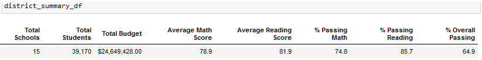
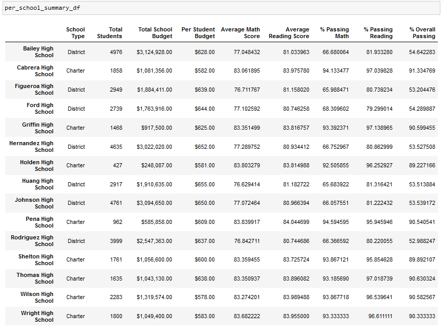

                                                                                           Michelle Werner (5/1/2022)
# School District Analysis
---

<!---->

Pictured: Maria's School District

## Project Overview:

For this project, I am helping Maria, the chief data scientist for a city school district, analyze standardized test data. The analysis we prepare will provide insights for the School Board, showcasing trends that will help to identify patterns and inform discussions on strategic district decisions on school budgets and priorities. 

For our initial analysis, Maria chose the reports below to return to the board (making sure to follow FERPA guidelines and not publicize private student data):
- A district summary (with school type, total students, total budget, average passing scores and rates)
- A school summary (the above info for each individual school in the district)
- The top 5 schools & the bottom 5 schools (with the highest percentage of students passing both reading and math)
- Average math and reading scores for each school (based on test result means and percentages)
- School spending per student
- Scores by school size (in student counts)
- Scores by school type

We were happy with the results when we were made aware that one school's data was incorrect for 9th grade math and reading test results. Once realizing this, all of our reports were re-run with the following results...

## Results: 

### District Summary - 
In our original District Summary, the average Math and Reading scores and percentages were actually only slightly higher in our final report than they were in our final where we left out all 9th grade test results for the school in question (Thomas HS):

ORIGINAL:

| Total Schools |	Total Students |    Total Budget |	Average Math Score | Average Reading Score | % Passing Math |	% Passing Reading |	% Overall Passing |
| ------------- |	-------------- | --------------- |	------------------ | --------------------- | -------------- |	----------------- |	----------------- |
|	           15 |	        39,170 |	$24,649,428.00 |	              79.0 |                 	81.9 |	           75 |               86 	|                 65|

FINAL (THS 9th M&R ignored):

| Total Schools |	Total Students |    Total Budget |	Average Math Score | Average Reading Score | % Passing Math |	% Passing Reading |	% Overall Passing |
| ------------- |	-------------- | --------------- |	------------------ | --------------------- | -------------- |	----------------- |	----------------- |
| 	         15 |	        39,170 |	$24,649,428.00 |                78.9 |	                81.9 |           74.8 |           	85.7 	|               64.9|

<!--  -->

### School Summary -
In our School Summary, which listed each school individually, there was a significant drop in the passing percnetages for our one anomalous high school (Thomas HS) only when we did not account for the fewer number of students. Once we were able to insert custom totals for those percentages correctly, again we noticed only a slight difference (decline) in the total passing rates from our original:

ORIGNAL:

| School Name  | Type    | Total Stus |	Budget        | Per Stu Budget | Avg Math Score | Avg Read Score | % Passing Math | % Passing Reading |	% Overall Passing |
| ------------ | ------- | ---------- | ------------- |	-------------- | -------------- | -------------- | -------------- |	----------------- | ----------------- |
|	Thomas HS    | Charter |	     1635 |	$1,043,130.00 |	       $638.00 |      83.418349 |   	 83.848930 |      93.272171 |	        97.308869 |       	90.948012 |

FINAL (THS 9th M&R ignored):

| School Name  | Type    | Total Stus |	Budget        | Per Stu Budget | Avg Math Score | Avg Read Score | % Passing Math | % Passing Reading |	% Overall Passing |
| ------------ | ------- | ---------- | ------------- |	-------------- | -------------- | -------------- | -------------- |	----------------- | ----------------- |
|	Thomas HS    | Charter |	     1635 |	$1,043,130.00 |	       $638.00 |      83.350937 |    	 83.896082 |      93.185690 |	        97.018739 |       	90.630324 |

- How is the school summary affected?

 &nbsp; 
- How does replacing the ninth graders’ math and reading scores affect Thomas High School’s performance relative to the other schools?
- How does replacing the ninth-grade scores affect the following:
  - Math and reading scores by grade
  - Scores by school spending
  - Scores by school size
  - Scores by school type

## Summary: 

Summarize four changes in the updated school district analysis after reading and math scores for the ninth grade at Thomas High School have been replaced with NaNs.
