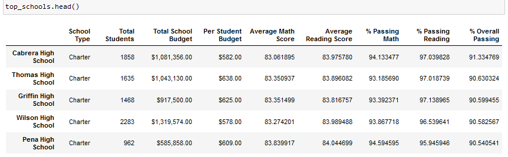
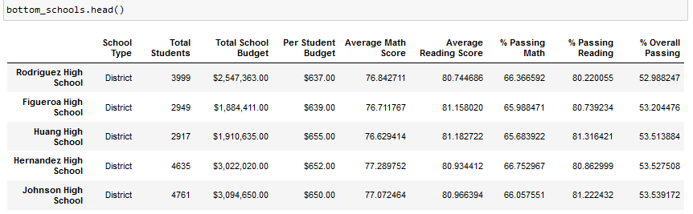

<!--                                                                                           Michelle Werner (5/1/2022)-->
# School District Analysis
---

<!---- >

Pictured: Maria's School District-->

## Project Overview:

The chief data scientist for a city school district has requested assistance analyzing standardized test data. This analysis will provide insights for the School Board, showcasing trends that will help to identify patterns and inform discussions on strategic district decisions on school budgets and priorities. 

For initial analysis, the reports below were created and returned to the board (with adherence to FERPA guidelines, keeping private student data unpublicized):
- A district summary (with school type, total students, total budget, average passing scores and rates)
- A school summary (the above info for each individual school in the district)
- The top 5 schools & the bottom 5 schools (with the highest percentage of students passing both reading and math)
- Average math and reading scores for each school (based on test result means and percentages)
- School spending per student
- Scores by school size (in student counts)
- Scores by school type

Once results were in, it was announced that one school's data was incorrect and that their 9th grade math and reading test results would need to be left off, and all report results re-calculated. Below are the results before and after that exclusion, and a comparison of the exclusion's effect.

## Results: 

### District Summary - 
In the original District Summary, the average Math and Reading scores and percentages were actually only slightly higher than they were in the final report where all 9th grade test results for the school in question (Thomas HS) were left out:

ORIGINAL:

| Total Schools |	Total Students |    Total Budget |	Average Math Score | Average Reading Score | % Passing Math |	% Passing Reading |	% Overall Passing |
| ------------- |	-------------- | --------------- |	------------------ | --------------------- | -------------- |	----------------- |	----------------- |
|	           15 |	        39,170 |	$24,649,428.00 |	              79.0 |                 	81.9 |	           75 |               86 	|                 65|

FINAL (THS 9th M&R ignored):

| Total Schools |	Total Students |    Total Budget |	Average Math Score | Average Reading Score | % Passing Math |	% Passing Reading |	% Overall Passing |
| ------------- |	-------------- | --------------- |	------------------ | --------------------- | -------------- |	----------------- |	----------------- |
| 	         15 |	        39,170 |	$24,649,428.00 |                78.9 |	                81.9 |           74.8 |           	85.7 	|               64.9|

<!--  -->

### School Summary -
In the School Summary, which listed each school individually, there was a significant drop in the passing percentages for the one anomalous high school (Thomas HS) only when the fewer number of total students was not accounted for. Once custom totals were inserted with accurate total counts for the number of actual scores used, the percentages adjusted and again there was only a slight difference in the total passing rates from the original. The passing-reading-percentage increased slightly, all others declined:

ORIGNAL:

| School Name  | Type    | Total Stus |	Budget        | Per Stu Budget | Avg Math Score | Avg Read Score | % Passing Math | % Passing Reading |	% Overall Passing |
| ------------ | ------- | ---------- | ------------- |	-------------- | -------------- | -------------- | -------------- |	----------------- | ----------------- |
|	Thomas HS    | Charter |	     1635 |	$1,043,130.00 |	       $638.00 |      83.418349 |   	 83.848930 |      93.272171 |	        97.308869 |       	90.948012 |

FINAL (THS 9th M&R ignored):

| School Name  | Type    | Total Stus |	Budget        | Per Stu Budget | Avg Math Score | Avg Read Score | % Passing Math | % Passing Reading |	% Overall Passing |
| ------------ | ------- | ---------- | ------------- |	-------------- | -------------- | -------------- | -------------- |	----------------- | ----------------- |
|	Thomas HS    | Charter |	     1635 |	$1,043,130.00 |	       $638.00 |      83.350937 |    	 83.896082 |      93.185690 |	        97.018739 |       	90.630324 |

### Math and Reading Scores (Adjusted) -
Pictured below are Math and Reading scores for all schools by grade (numbers left off are signified by "nan"):
 &nbsp; 

And in the FULL District Report (listed alphabetically) comparisons between all schools are easily viewable:

### Top & Bottom 5
By replacing the 9th grade Thomas HS data, no difference in the ranking placement of any Top 5 or Bottom 5 performing school was apparent. Below are the final versions of those two reports:

## Summary: 

In summary, after reading and math scores for the ninth grade at Thomas High School were replaced with NaNs, there were only slight variations in the new final reports from the originals. While Math and Reading passing rates did change slightly, Thomas High School's ranking as the #2 school in the district remains true. The only pattern observed from the data seems to be that district schools struggle significantly with math passing rates. This could be due to larger numbers of students or perhaps attracting fewer talented math teachers or something else unknown from this dataset. It seems to occur regardless of budget. A survey of the high-scoring schools math programs might lead to insights of what's working.
